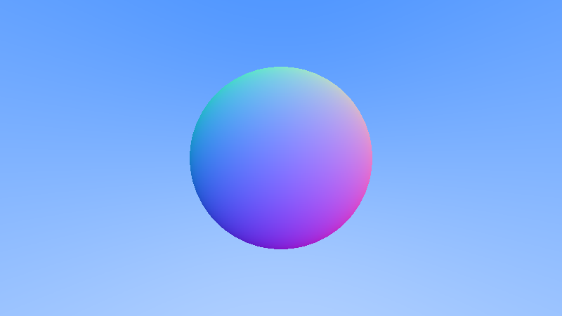

# Ray Tracing in One Weekend

This project presents the implementation of the project [Ray Tracing in One Weekend](https://raytracing.github.io/books/RayTracingInOneWeekend.html) in Kotlin

### First image

### Surface normals

### Sphere with ground

### Antialiasing

### Diffuse sphere

### Gamma corrected diffuse sphere

### Lamberitan sphere

### Metal spheres

### Fuzzed metal spheres

### Refractions

### Positionable camera

### Depth of field

### Final
